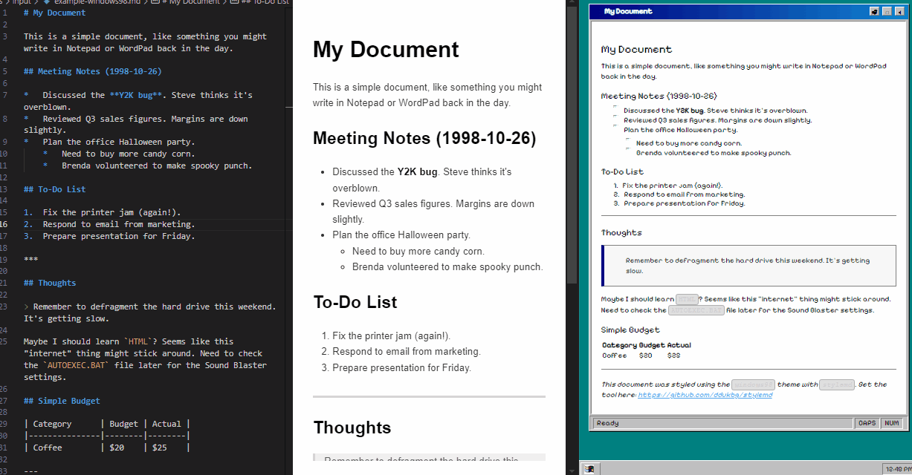

# stylemd

<!-- Logo Placeholder -->
<p align="center">
  
</p>

A command-line tool to generate static HTML pages from Markdown files, applying various style themes.

<!-- Core Functionality Visual Placeholder -->
<p align="center">
    
    
    
</p>

[](https://www.npmjs.com/package/@ddukbg/stylemd) <!-- Placeholder: Replace with actual badge if published -->
[](https://opensource.org/licenses/MIT) <!-- Assuming MIT License -->

## Features

*   Convert Markdown files to HTML.
*   Apply a variety of pre-built themes.
*   Simple command-line interface.
*   Uses `marked` for Markdown parsing and `handlebars` for templating.

## Installation

There are two ways to install `stylemd`:

### 1. Global Installation (Recommended for general use)

If you want to use `stylemd` as a command-line tool anywhere on your system, install it globally via npm:

```bash
npm install -g @ddukbg/stylemd
```

Make sure you have Node.js and npm installed.

### 2. Local Development Setup

If you want to contribute to the project or modify the code:

1.  **Clone the repository:**
    ```bash
    git clone https://github.com/ddukbg/stylemd.git # Replace with your actual repo URL if different
    cd stylemd
    ```
2.  **Install dependencies:**
    ```bash
    npm install
    ```
3.  **Link the package:** This allows you to run the `stylemd` command locally using the cloned code.
    ```bash
    npm link
    ```
    Now you can run `stylemd` from any directory, and it will use the code in your cloned `stylemd` folder.

## Usage

```bash
stylemd <markdownFile> [options]
```

**Arguments:**

*   `<markdownFile>`: Path to the input Markdown file (e.g., `notes.md`, `examples/input/example-default.md`).

**Options:**

*   `-t, --template <name>`: Template name to use (default: `default`). See available themes below.
*   `-o, --output <file>`: Output HTML file path (default: `index.html`).
*   `-h, --help`: Display help for command.
*   `-V, --version`: Output the version number.

**Examples:**

```bash
# Use the 'windows98' theme for 'mydoc.md' and output to 'mypage.html'
stylemd mydoc.md -t windows98 -o mypage.html

# Use the 'terminal' theme for an example file, output to the root
stylemd examples/input/example-terminal.md --template terminal --output example-output-terminal.html

# Use the default theme and output to 'index.html'
stylemd README.md
```

## Available Themes

Here are the currently included themes:

1.  **`default`**: Clean, modern baseline style suitable for general documents. [Live Preview](https://stylemd.pages.dev/example-output-default.html)
2.  **`windows98`**: Mimics the classic Windows 98 UI elements. [Live Preview](https://stylemd.pages.dev/example-output-windows98.html)
3.  **`terminal`**: Simulates an old-school terminal output with prompt and cursor. [Live Preview](https://stylemd.pages.dev/example-output-terminal.html)
4.  **`geocities`**: A nostalgic, chaotic, and fun GeoCities-inspired theme. [Live Preview](https://stylemd.pages.dev/example-output-geocities.html)
5.  **`blueprint`**: Technical blueprint style with grid background and annotations. [Live Preview](https://stylemd.pages.dev/example-output-blueprint.html)
6.  **`macos-classic`**: Inspired by the look and feel of macOS Classic (System 7/8/9). [Live Preview](https://stylemd.pages.dev/example-output-macos-classic.html)
7.  **`amiga-workbench`**: Emulates the Amiga Workbench 1.x interface. [Live Preview](https://stylemd.pages.dev/example-output-amiga-workbench.html)
8.  **`msdos`**: Text-mode interface resembling MS-DOS prompt and `edit.com`. [Live Preview](https://stylemd.pages.dev/example-output-msdos.html)
9.  **`c64`**: Commodore 64 BASIC screen style with pixel font. [Live Preview](https://stylemd.pages.dev/example-output-c64.html)
10. **`vim`**: Minimalist theme inspired by the Vim editor (Solarized Dark). [Live Preview](https://stylemd.pages.dev/example-output-vim.html)
11. **`retro-console`**: Monochrome retro game console/HUD interface (like Fallout's Pip-Boy). [Live Preview](https://stylemd.pages.dev/example-output-retro-console.html)
12. **`pixel-art`**: Retro RPG style with pixel font and UI window elements. [Live Preview](https://stylemd.pages.dev/example-output-pixel-art.html)
13. **`y2k`**: Early 2000s web design aesthetic with Aqua elements. [Live Preview](https://stylemd.pages.dev/example-output-y2k.html)
14. **`frutiger-aero`**: Mid-2000s style with glossy, glassy, and nature-inspired elements. [Live Preview](https://stylemd.pages.dev/example-output-frutiger-aero.html)

*(You can find the corresponding template files in the `/templates` directory and example markdown files in `/examples/input`.)*

## Project Structure

```
stylemd/
├── bin/                 # CLI script
├── templates/           # Theme templates (.hbs)
├── examples/
│   ├── input/           # Example Markdown files
│   └── output/          # Example generated HTML (Git ignored)
├── node_modules/        # Dependencies (Git ignored)
├── .gitignore           # Files/folders ignored by Git
├── package.json
├── package-lock.json
└── README.md
```

## Custom Templates

Currently, `stylemd` only loads templates from its internal `/templates` directory. Using templates from custom external directories is **not yet supported**.

## Contributing

Contributions are welcome! If you'd like to add new themes, improve existing ones, fix bugs, or add features (like custom template directory support), please follow these steps:

1.  **Fork** the repository.
2.  Create a new **branch** for your feature or fix (`git checkout -b feature/my-new-theme`).
3.  Make your changes. Ensure new themes are added as `.hbs` files in the `templates` directory and consider adding a corresponding example `.md` file in `examples/input`.
4.  Test your changes locally.
5.  Commit your changes (`git commit -am 'Add some feature'`).
6.  Push to the branch (`git push origin feature/my-new-theme`).
7.  Create a new **Pull Request**.

## Future Plans (Roadmap)

Here are some features planned for future releases:

*   **Custom Template Directory:** Support for loading themes from a user-specified directory (`--template-dir` option). This will allow users to easily create and use their own themes without modifying the core package.
*   **Watch Mode:** A `--watch` flag to automatically re-generate the HTML file when the source Markdown file is modified, providing a live preview experience during editing.
*   **Directory Conversion:** Ability to process an entire directory of Markdown files at once, converting each `.md` file into a corresponding HTML file, potentially mirroring the input directory structure.

Contributions towards these features are welcome!

## License

This project is licensed under the **MIT License**. See the [LICENSE](LICENSE) file for details (assuming you will add one). 